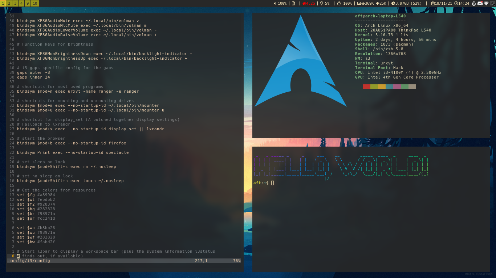
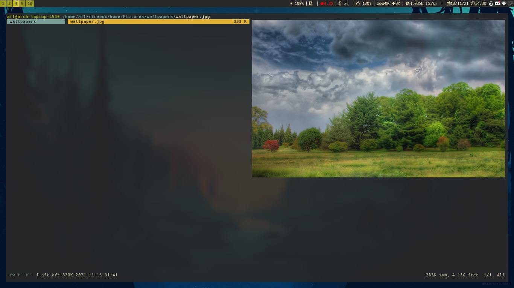

# Ricebox
My i3 setup config files and scripts

## Overview

The dot files and scripts that I use on my daily driver laptop. I'm running them on Arch, though they should work on Debian as well.

These files include:

- Configs for ZSH
- Configs for i3
- Configs for neovim
- Configs for ranger
- Configs for picom
- Scripts for a custom status bar
- Scripts for general stuff (session locking, mounting/unmounting drives...)

## Screenshots



## Installation

To install, open the terminal in a (preferably minimal) Arch, Debian or Ubuntu install, and type the following commands in a terminal:

```
git clone https://github.com/aftoul/ricebox
cd ricebox
./install.sh
```

Not that this will setup my prefered programs along with the config files. To make it so only the configs are installed:

```
git clone https://github.com/aftoul/ricebox
cd ricebox
./install.sh --no-deps
```

## License

This project is licensed under the GPLv3 License - see the [LICENSE.md](LICENSE.md) file for details


